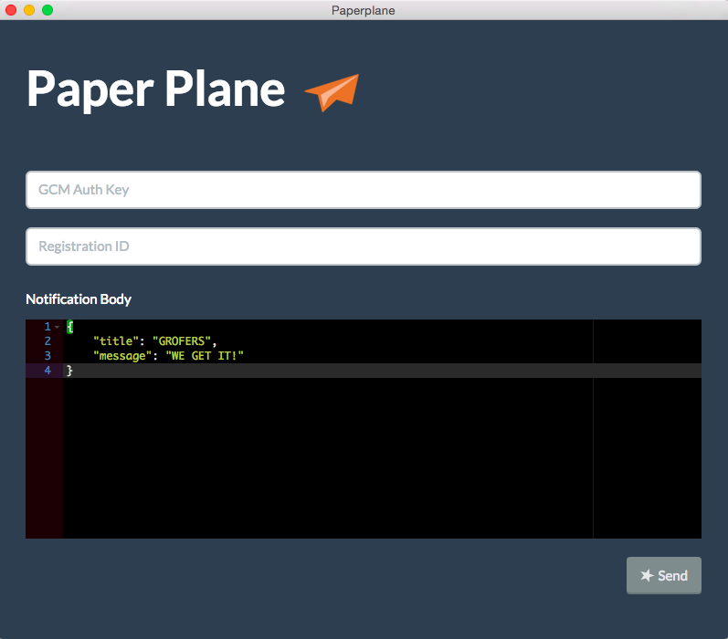

**Paper Plane** is an electron app to send GCM notifications. You can use this to test notifications on GCM.
To send a notification you need GCM auth key, GCM token/registration id and notification. You can send notification to multiple ids by inserting them in a comma separated format.

## Installation
Follow these steps for installation
 1. Clone the repo `$ git clone https://github.com/grofers/paperplane.git`
 2. You need to install [*NPM*](https://nodejs.org/en/download/), if you don't have it already. It is bundled with nodejs.
 3. Install the dependencies. `$ npm install`
 4. Run the app using `$ npm start`

## Authors
[Vishesh Jindal](https://github.com/vishesh92)  
[Chitharanjan Das](https://github.com/cdax)

## License
See [LICENSE](LICENSE.md)
